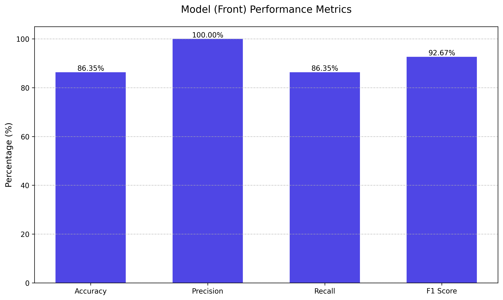
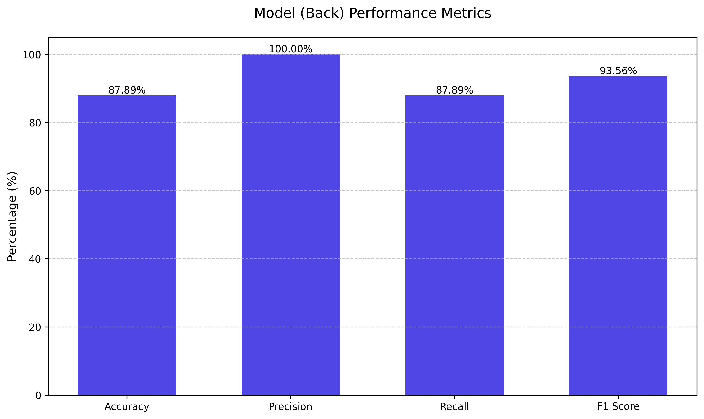
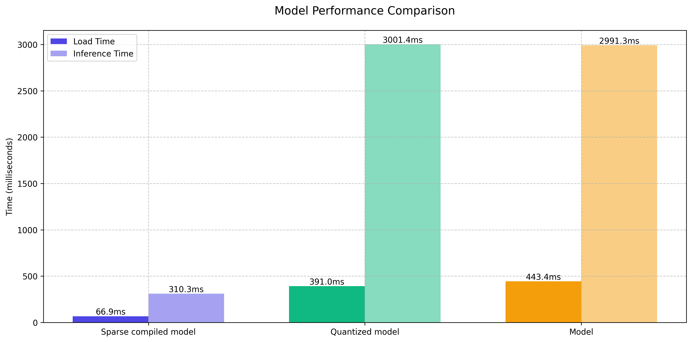
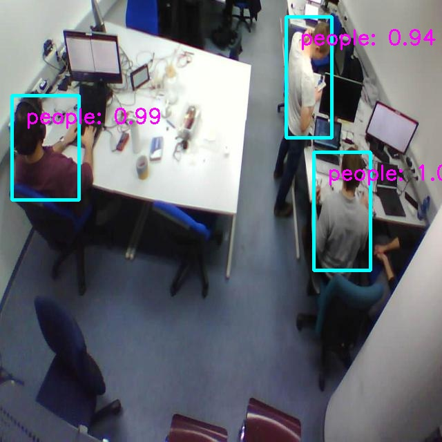

# Edge-Optimized MobileNetV2-SSD Object Detection

An optimized implementation of object detection using MobileNetV2 backbone with SSD (Single Shot MultiBox Detector), specifically designed for edge devices. This implementation focuses on model compression and efficiency while maintaining detection accuracy.

## Overview

This project adapts the MobileNetV2-SSD implementation from [pytorch-ssd](https://github.com/qfgaohao/pytorch-ssd) with several optimizations for edge deployment:
- Model compression techniques (pruning, quantization)
- Model fine-tuning for loss afer compression
- Model compilation for arm target hardware
- Optimized data processing pipeline
- Training adaption with validation accuracy and stop loss
- Flask server for deployment

## Project Structure

```
computer_vision/
├── compression/                   # Model compression implementations
│   ├── fine_grain_prune.py        # Magnitude pruning
│   └── k_mean.py                  # K-means quantization
|   └── tensor_utils.py            # Quantized Model and tensors
|   └── model_profile.py           # Profiling the model               
├── datasets/                      # Dataset processing adaptations
│   ├── annotation_format.py       # Annotation processing
│   └── open_images.py             # Data loading pipeline
├── models_parameters/             # Model weights and configurations
│   ├── labels.txt                 # Classes in the dataset
│   └── back_model.pth             # Object detection model from the back camera
|   └── front_model.pth            
|   └── mb2-ssd-lite-mp-0686.pth   # Original weights that trained on COCO dataset
|   └── quantized.pth              # Compressed weights from K-means quantization
|   └── sparse_model_80.0%.pth     # Pruned model with 80% accuracy
├── object_detection/              # MobileNetV2-SSD implementation
│   ├── mobilenet_v2_ssd.py        # Combiniation Mobilenet V2 basenet with SSD
│   └── mobilenetv2.py             # Implementation of MobilenetV2
|   └── ssd.py                     # Implemenation of SSD
├── server/                        # Flask server implementation
│   ├── app.py                     # Endpoint to check if 2 images have big changes
│   └── model_front.py             # Endpoint to run the inferece
├── training/                      # Training utilities
│   ├── data_processing.py         
│   └── predictor.py               # Inference with the original model 
│── tvm/
│   ├── compile_model.py           # Compile the sparse model to raspberry pi object file
│   └── prediction.py              # Run inference with the compiled model
│   └── tuning.py                  # Parameters tuning for more optimization for compiled model
│── tvm_model/                     
└── utils/                         # Utility functions
│    ├── box_utils.py              # Apply constraints to the generated boxes
│    └── config.py                 # Constraints for the boxes
│    └── misc.py                   # Timer and loading checkpoint
│    └── multibox_loss.py          # Loss function for boxes
│    └── transforms.py             # Data augmentation for training
└── visualization/
└── run_training.py                # Run finetuning with pre-trained network
└── test_model.py                  # Test prediction of the model
```

## Notes  
- **IMPORTANT**: Run the following in the computer_vision directory first
 ``
 export PYTHONPATH=$(pwd)
 ``
- **Tested Edge Devices**: Raspberry Pi 3B+, Raspberry Pi 4  
- **Dataset**: the models are trained on limited dataset
- **Model Storage**: The models and their quantized versions are stored in the `models_parameters` folder.  
- **Sparse Compiled Models**: These are stored in the `tvm_models` folder.  

## Usage

### Dataset
The dataset for both **front** and **back** models is provided in the `dataset` folder.

To preprocess the dataset, rn the `RUN_DATA_PROCESSING.sh`

### Training
Execute the training script:
```bash
./RUN_TRAINING.sh
```

For finetuning after quantization, uncomment the relevant section in `RUN_TRAINING.sh`.

### Model Compression
For detailed compression instructions, see `compression/README.md`.

### TVM Compilation Guide

There are two approaches for compiling your sparse model with TVM:

#### Option 1: Direct Compilation on Raspberry Pi (Recommended)
The simplest approach is to copy the required directories (`tvm`, `object_detection`, and `training`) directly to your Raspberry Pi and run the compilation script:

```bash
python compile_model.py
```

#### Option 2: Build TVM Runtime on Raspberry Pi

Alternatively, you can build the TVM runtime from source:

```bash
# Clone TVM repository with submodules
git clone --recursive https://github.com/apache/tvm
cd tvm

# Prepare build directory
mkdir build
cp cmake/config.cmake build

# Build the runtime
cd build
cmake ..
make runtime -j4

# Set Python path
echo "export PYTHONPATH=\$PYTHONPATH:~/tvm/python" >> ~/.bashrc
source ~/.bashrc
```

#### Setting up RPC Server

After installation, start the RPC server:

```bash
python -m tvm.exec.rpc_server --host 0.0.0.0 --port=9090
```

The following message indicates successful server startup:
```
INFO:root:RPCServer: bind to 0.0.0.0:9090
```

#### Performance Tuning (Optional)

To optimize performance for your specific hardware:

```bash
# Run the tuning script (from your development machine)
python tvm/tuning.py
```

This tuning process creates specialized kernels that maximize hardware utilization 

#### Testing on x86

In the script `compile_model`, change the `target = "llvm -mtriple=aarch64-linux-gnu -mattr=+neon"` to `target = "llvm"`. Then adapt the name in `prediction.py` and run.

### Server Deployment
```bash
# Install qemu for cross-platform builds
sudo apt update && sudo apt install -y qemu-user-static

# Create a builder
docker buildx create --use

# Build and push the Docker image
docker buildx build --platform linux/arm64 -t hoangledoan/bibi-model:latest -f server/Dockerfile.modelfront .
```

## Model Performance

The performance metrics for both front and back models are displayed below:

<p align="center">
    
    
</p>
To test the performance, run:

```bash
python benchmark.py
```
Note that you may have to fix the file path to the dataset

Performance comparison between sparse compiled model, K-means quantized model, and base model. Note that accuracy remains almost unchanged across all techniques after fine-tuning.

<p align="center">
    
</p>

Video to see the performance of the sparse compiled model: https://youtu.be/B6NVRFzobsg

Compare to base model and quantized model performance: https://youtu.be/5ZvjRRCLpEs

## Model testing
To test the output of the model, run:

```bash
python test_model.py
```
<p align="center">
    
</p>

## Acknowledgments

- Original implementation: [pytorch-ssd](https://github.com/qfgaohao/pytorch-ssd)
- MobileNetV2 paper: [MobileNetV2: Inverted Residuals and Linear Bottlenecks](https://arxiv.org/abs/1801.04381)
- SSD paper: [SSD: Single Shot MultiBox Detector](https://arxiv.org/abs/1512.02325)